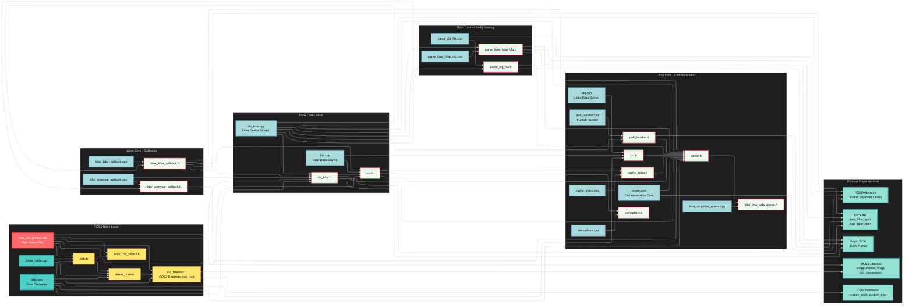

```mermaid
---
config:
  layout: elk
  theme: neo-dark
---
flowchart LR
 subgraph subGraph0["ROS2 Node Layer"]
        livox_ros_driver2.cpp["livox_ros_driver2.cpp<br>Main Entry Point"]
        driver_node.cpp["driver_node.cpp"]
        lddc.cpp["lddc.cpp<br>Data Converter"]
        driver_node.h["driver_node.h"]
        lddc.h["lddc.h"]
        livox_ros_driver2.h["livox_ros_driver2.h"]
        ros_headers.h["ros_headers.h<br>ROS2 Dependencies Hub"]
  end
 subgraph subGraph1["Livox Core - Main"]
        lds_lidar.cpp["lds_lidar.cpp<br>Lidar Device System"]
        lds.cpp["lds.cpp<br>Lidar Data Service"]
        lds_lidar.h["lds_lidar.h"]
        lds.h["lds.h"]
  end
 subgraph subGraph2["Livox Core - Communication"]
        ldq.cpp["ldq.cpp<br>Lidar Data Queue"]
        comm.cpp["comm.cpp<br>Communication Core"]
        pub_handler.cpp["pub_handler.cpp<br>Publish Handler"]
        lidar_imu_data_queue.cpp["lidar_imu_data_queue.cpp"]
        cache_index.cpp["cache_index.cpp"]
        semaphore.cpp["semaphore.cpp"]
        ldq.h["ldq.h"]
        comm.h["comm.h"]
        pub_handler.h["pub_handler.h"]
        lidar_imu_data_queue.h["lidar_imu_data_queue.h"]
        cache_index.h["cache_index.h"]
        semaphore.h["semaphore.h"]
  end
 subgraph subGraph3["Livox Core - Callbacks"]
        lidar_common_callback.cpp["lidar_common_callback.cpp"]
        livox_lidar_callback.cpp["livox_lidar_callback.cpp"]
        lidar_common_callback.h["lidar_common_callback.h"]
        livox_lidar_callback.h["livox_lidar_callback.h"]
  end
 subgraph subGraph4["Livox Core - Config Parsing"]
        parse_cfg_file.cpp["parse_cfg_file.cpp"]
        parse_livox_lidar_cfg.cpp["parse_livox_lidar_cfg.cpp"]
        parse_cfg_file.h["parse_cfg_file.h"]
        parse_livox_lidar_cfg.h["parse_livox_lidar_cfg.h"]
  end
 subgraph subGraph5["External Dependencies"]
        ros2["ROS2 Libraries<br>rclcpp, sensor_msgs, pcl_conversions"]
        livox_interfaces["Livox Interfaces<br>custom_point, custom_msg"]
        livox_api["Livox API<br>livox_lidar_api.h<br>livox_lidar_def.h"]
        rapidjson["RapidJSON<br>JSON Parser"]
        posix["POSIX/Network<br>socket, arpa/inet, unistd"]
  end
    livox_ros_driver2.cpp --> livox_ros_driver2.h & ros_headers.h & driver_node.h & lddc.h & lds_lidar.h  & ros2
    driver_node.cpp --> driver_node.h & lddc.h
    lddc.cpp --> lddc.h & ldq.h & comm.h & ros_headers.h & driver_node.h & lds_lidar.h
    driver_node.h --> ros_headers.h
    lddc.h --> livox_ros_driver2.h & driver_node.h & lds.h
    ros_headers.h --> ros2 & livox_interfaces
    lds_lidar.cpp --> lds_lidar.h & comm.h & pub_handler.h & parse_cfg_file.h & parse_livox_lidar_cfg.h & lidar_common_callback.h & livox_lidar_callback.h & posix
    lds.cpp --> lds.h & ldq.h
    lds_lidar.h --> lds.h & comm.h & livox_api & rapidjson
    lds.h --> semaphore.h & comm.h & cache_index.h
    ldq.cpp --> ldq.h
    comm.cpp --> comm.h & posix
    pub_handler.cpp --> pub_handler.h
    cache_index.cpp --> cache_index.h
    lidar_imu_data_queue.cpp --> lidar_imu_data_queue.h
    semaphore.cpp --> semaphore.h
    ldq.h --> comm.h
    comm.h --> lidar_imu_data_queue.h
    pub_handler.h --> livox_api & comm.h
    cache_index.h --> comm.h
    lidar_common_callback.cpp --> lidar_common_callback.h & lds_lidar.h
    livox_lidar_callback.cpp --> livox_lidar_callback.h
    lidar_common_callback.h --> comm.h
    livox_lidar_callback.h --> lds.h & lds_lidar.h & comm.h & livox_api
    parse_cfg_file.cpp --> parse_cfg_file.h & posix
    parse_livox_lidar_cfg.cpp --> parse_livox_lidar_cfg.h
    parse_cfg_file.h --> comm.h & rapidjson
    parse_livox_lidar_cfg.h --> comm.h & livox_api & rapidjson
     livox_ros_driver2.cpp:::mainFile
     driver_node.cpp:::nodeImpl
     lddc.cpp:::nodeImpl
     driver_node.h:::nodeHeader
     lddc.h:::nodeHeader
     livox_ros_driver2.h:::nodeHeader
     ros_headers.h:::nodeHeader
     lds_lidar.cpp:::coreImpl
     lds.cpp:::coreImpl
     lds_lidar.h:::coreHeader
     lds.h:::coreHeader
     ldq.cpp:::coreImpl
     comm.cpp:::coreImpl
     pub_handler.cpp:::coreImpl
     lidar_imu_data_queue.cpp:::coreImpl
     cache_index.cpp:::coreImpl
     semaphore.cpp:::coreImpl
     ldq.h:::coreHeader
     comm.h:::coreHeader
     pub_handler.h:::coreHeader
     lidar_imu_data_queue.h:::coreHeader
     cache_index.h:::coreHeader
     semaphore.h:::coreHeader
     lidar_common_callback.cpp:::coreImpl
     livox_lidar_callback.cpp:::coreImpl
     lidar_common_callback.h:::coreHeader
     livox_lidar_callback.h:::coreHeader
     parse_cfg_file.cpp:::coreImpl
     parse_livox_lidar_cfg.cpp:::coreImpl
     parse_cfg_file.h:::coreHeader
     parse_livox_lidar_cfg.h:::coreHeader
     ros2:::external
     livox_interfaces:::external
     livox_api:::external
     rapidjson:::external
     posix:::external
    classDef mainFile fill:#ff6b6b,stroke:#c92a2a,stroke-width:3px,color:#fff
    classDef nodeImpl fill:#4ecdc4,stroke:#0a9396,stroke-width:2px,color:#000
    classDef coreImpl fill:#a8dadc,stroke:#457b9d,stroke-width:2px,color:#000
    classDef nodeHeader fill:#ffe66d,stroke:#f4a261,stroke-width:2px,color:#000
    classDef coreHeader fill:#f1faee,stroke:#e63946,stroke-width:2px,color:#000
    classDef external fill:#95e1d3,stroke:#38ada9,stroke-width:2px,color:#000

```